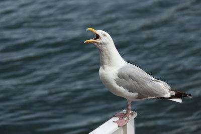

# CGoL Simulator # 

## Motivation / Background ##

The purpose of this project is to create, from scratch, a simulator of Conway's Game of Life, i.e., a board/grid of cells where each cell is either alive or dead and where each cell's state is evaluated after each turn based on these simple rules:

1. Any live cell with exactly 2 or 3 neighbors survives.
2. Any dead cell with exactly 3 neighbors becomes a live cell.
3. _All other_ cells die or stay dead in next generation.

***

## Notes - for Sirrele & Courtney ##
- **makeTurn nested functions - is top lexically best? Obv hoisting makes anywhere work, but what is accepted as best?**
- **how to stop auto makeTurn function ??? - Sirrele**
- Single Array internals - wait for PR (product review?)
- want to add boardSize selector in html but having hiccups

## Notes - for myself ##
- remove seagull

- separate countNeighbors() func from makeTurn()
  - optimize next ... pass in shared neighbors, if any (savings from evaluating edge cases)

- for readme, add in a separate section for internal functions and user-available methods

- (for later) look at internal functions & try to make less reliant on single array structure

- all board functionality in mini-framework comments:
    - then set up html/DOM code accessing the boardHTML thru those channels/methods (make button events easier)
    - **some methods, like clearBoard, makemark, should auto call displayBoard ... or wrap in button event handlers ... ?**
    - learning note: look into this.boardHTML in Cgol.init (was opening up that variable into the regular namespace)

***

## Code Structure and Style Guide ##

The Cgol project is internally designed around a single array representation of the board. The cell indices look like this:

    0 1 2
    3 4 5
    6 7 8

_Note:_ In this instance, the boardSize would be 3 (size of one side of the board) and the totalLength would be 9 (the length of the board as a single array).

* The library maintains only one board per initialized instance (see _How to Use_ section) to better serve HTML visuals. Currently there is no resizing method, but that is a future goal.

* Once the board is initialized and the internal variables set, createHtmlBoardElements() is called to set up the HTML board. It adds the number of table rows(\<tr\>) and table data (\<td\>) appropriate to the selected boardSize, adds them to the _document_, and stores them internally for future calls in a nested array _boardHtmlTableRowsArray_. Each table cell element is also given an eventListener to process clicks to the specific cells (i.e., call makeMark() or clearMark()).

* I used JavaScript for all of the internal work and some HTML and CSS for the lackluster page visuals. Eventually I'd like to improve the webpage representation with better HTML and CSS and maybe even some Angular to add in single-page animations (?).

***

## How to Use ##
The CGoL library is set up like a very simple jQuery; the user calls the initializer function (passing in the size of the board) and then has access to other library methods via the prototype of that object:

    const board = CgolBoardInitializer(15);
    board.makeMark(2);

In addition to the methods, there are some internal variables made available to the user with _get_ functions: boardSize and totalLength, which return the size of one side of the board and the length of the board's single array respectively.

## Methods Available ##

- **CgolBoardInitializer(boardSize)**
  
  Initializes the library and sets size of board (input of 5 creates a 5x5 board). Also sets up the HTML representation of the board. 

- **makeMark(index_singleLine_X, index_Y)**

  Takes index and sets that cell to alive (**does not flip states**, i.e., no alive to dead). It can take either a single index or two indices (follows JavaScript 2D array notation; built in for future HTML options or 2D array considerations).

      0,0  0,1  0,2
      1,0  1,1  1,2
      2,0  2,1, 2,2 

- **makeMarkRandom(markCount)**

  Creates markCount number of random marks on board. 

- **clearMark(indexForSingleLineX, indexForY)**

  Like makeMark(), it can take either a single number index or a double number index. Sets indexed cell to dead state regardless of current cell condition.

- **clearBoard()**

  Sets all cells to dead. 

- **displayBoardHTML()**

  Updates the text content of HTML elements representing the board.

- **makeTurn()**

  Advances state of the board to next turn/tick; evaluates each cell and its surrounding neighbors and determines if that cell lives or dies. Stores the resulting board in a new array and then sets the main internal board array equal to the result. 

  The number of neighbors is summed row by row: first the row above the current cell; then the row the current cell sits on (only up to two neighbors); and then the row beneath it. To account for edge-cases, makeTurn splits this proccess up in to three parts.

  1. setForLoopNeighborIndices(cellIndex)
      - For given cell index, set start and stop indices of forLoops depending on where the index cell is: right edge, left edge, or interior.
      - Counts number of alive neighbors in same row as index cell
      - returns called countTotNeighborsInRows (ie tot neighbors alive)
  2. countTotNeighborsInRows()
      - runs the for loops to count neighbors in rows above and below cell index (func itself does not need to know cell index, only forLoop indices)
      - returns final number of neighs alive
  3. makeTurn() 
      - Takes the resulting number of neighbors and determines if the cell should live or die based on the CGoL rules and whether the cell is currently alive or dead.  
      - Repeats and calls the previous two functions for every cell in board
 

***

## Credits ##

1. The current _makeRandomMarkAutoTurns_ timing feature was provided by Sirrele. 